# Ch 4 · 优化的简单应用：从回归、分类到速度规划

> 一句话：把模型参数化、目标函数与验证连成一条项目链，再用七个可运行 demo 检查这套思路。

## §1 目标

前面三章让我们认得 Python、NumPy 和 PyTorch 优化工具，这一章开始把工具放进具体问题。跑完七个 demo 后，我们看到线性回归、Ridge、Lasso、逻辑回归、Softmax 回归、SVM 和速度规划时，不再只看到七个名字，而会先问：决策变量是什么，损失如何表达任务，结果怎样验证。算法的外形不同，背后仍是同一套设计思路在不同任务上的应用。

我们还会熟悉用 `torch.float64` 张量、显式梯度、`log_softmax`、NLL、hinge loss、proximal gradient descent 和 Adam 写小型优化问题的常见形态。后续章节再次出现 SVM、SGD 或 Adam 时，我们能认出它们在目标函数和参数更新链条中的位置，也能顺着 API 找到需要检查的输入、输出和数值。

这里的承诺仍然有限。七个 demo 让我们见过算法怎样落到代码与验证上，不等于能处理所有数据分布，也不等于能独立推完每个算法的理论。更不会因为玩具数据达到 `accuracy=1.0`，就把同一数字外推到真实项目。

## §2 为什么从 Ch 4 起换写法

Ch 1 到 Ch 3 的任务是扫盲。那三章先让我们认得语言、矩阵和优化术语，重点是看到 `W`、`b`、梯度、KKT、SGD 或 Adam 时能对上号。并列的小例子适合完成这一步，因为当时的问题只是“这是什么”。

从这一章开始，问题变成“我怎样把一个任务做成可运行、可检查的项目”。我不再把七种算法排成术语清单，而是让前一个项目的 Evaluation 暴露下一个 Issue。线性回归先回答连续值预测，训练与测试差距引出 Ridge，权重不稀疏引出 Lasso，标签改成“是或否”后进入逻辑回归，再扩到多分类与间隔分类，最后把同一套路搬到非机器学习的速度规划。

这种写法的单位不是一个 API，而是 Issue、Method、Evaluation 的闭环。我先说要解决什么，再说我把什么设为变量、把什么写进损失，最后给出可复现数字和失败判据。后续 CNN 项目会更大，但不会换一套思维。

## §3 概念：两个可迁移问题

进入七个 demo 前，先建立一副共同框架。以后你面对一个新任务，可以先暂停搜索模型名称，连续问两个问题：模型怎么参数化，目标函数怎么设计。然后再补上验证，确认代码解决的是原问题，而不是只让某个 loss 数字下降。

### 参数化：我到底让优化器改什么

参数化（parameterization）是把问题的自由度写成可计算变量。在线性回归里，我让 `w` 和 `b` 决定一条直线，预测写成 `ŷ = x * w + b`。Softmax 回归把一个权重扩成矩阵 `W`，每一列对应一个类别。速度规划更能看出参数化的影响：我既可以直接改每个时刻的状态点，也可以改每段加速度，还可以改一组多项式系数。

选定变量后，模型能表达哪些答案也随之确定。一条直线不能表达弯曲关系，三次 Bernstein 多项式产生的是平滑加速度族，逐时刻状态点则给每个时刻更多自由度。参数太少，目标结构可能装不进去；参数很多，优化器要处理的自由度和约束也会增加。我在项目里先把输入、输出、变量形状写清楚，再开始求梯度。

代码层面，这一步通常表现为初始化张量并固定形状。例如二分类逻辑回归的 `w` 形状等于特征数，`b` 是标量；三分类 Softmax 回归的 `W` 是 `2x3`，`b` 长度为 `3`。一旦形状含义清楚，`X @ W + b` 就不再只是矩阵语法，而是“每个样本产生三个类别分数”。

### 目标函数：我用什么数字代表做得好

参数化回答“改什么”，目标函数回答“朝哪里改”。我会把任务要求写成一个标量损失 `L`。回归要让连续预测靠近标签，本章用均方误差（mean squared error，MSE），因为它对应高斯噪声下的负 log-likelihood，也会持续惩罚较大的残差。二分类输出概率，本章用二元交叉熵（binary cross entropy，BCE）；多分类输出类别分布，本章用负 log-likelihood（NLL）；SVM 不输出概率解释，而是对没有达到间隔的样本收 hinge loss。

有些任务要求不止一个。Ridge 在拟合误差之外加入权重的 L2 惩罚，Lasso 加入权重绝对值惩罚，速度规划同时关心终点、运动学一致性和平滑度。把这些项相加不是为了让公式变复杂，而是因为单独一个“到达终点”无法区分平滑轨迹和剧烈抖动轨迹。

这里要区分训练目标与项目评价。训练时优化器只看到 `L`，项目验收还要看 accuracy、train/test loss 差距、非零权重数量、终点误差和图形。一个损失能下降，只说明代码沿着当前目标走了，并不自动证明这个目标完整表达了任务。

### 负 log-likelihood：把 OLS 与 CrossEntropy 放在同一视角

概率假设能把几个看似无关的损失接起来。在线性回归中，我假设真实 `y` 围绕 `ŷ` 带有固定尺度的高斯噪声。让观测数据出现的 likelihood 变大，等价于让负 log-likelihood 变小；删去与参数无关的常数后，剩下的就是平方残差，也就是 OLS 使用的 MSE 视角。

二分类里，我把标签看成 Bernoulli 结果，sigmoid 给出标签为 `1` 的概率。真实标签出现的负 log-likelihood 正是 BCE。多分类里，softmax 给每一类分配概率，取真实类别的 log probability 再取负号，就是 NLL，也就是常见 CrossEntropy 的核心。

因此，OLS、BCE 和多分类 NLL 不是三个互不相干的公式。它们分别把连续高斯观测、Bernoulli 标签和类别标签的概率假设写成可优化目标。你以后看到一个新 loss，可以先问它隐含了怎样的数据生成假设，以及这个假设是否与任务相符。

### Evaluation：我怎样知道真的做对了

我会先定义可验证数字，再运行代码。每个 demo 的 `main` 入口都返回结构化结果，而不是只画一张看起来顺眼的图。线性回归同时比较 closed-form 与 GD 的 `w`、`b`，分类同时检查 loss 与 accuracy，速度规划同时检查三种参数化的终点和 spread。数字能进入测试，也能在换实现后直接比对。

第二层验证是图形。loss 曲线用来检查下降过程，拟合线与真值用来检查残差结构，决策边界与混淆矩阵用来检查错误落在哪里，速度和加速度曲线则暴露终点数字看不到的抖动。数字回答“达到门槛了吗”，图回答“错误有没有结构”。

第三层是失败判据。我不会把“程序跑完”当作通过。若 closed-form 与 GD 明显不一致，若测试 loss 持续远离训练 loss，若混淆矩阵有稳定的类别混淆，若三种速度参数化到达不同终点，我就回到参数化与目标函数重新检查。Evaluation 的作用不只是盖章，它还负责产生下一个可执行 Issue。

## §4 实战：七个项目

下面七个项目都按同一顺序展开。每一节先写 Issue，再写 Method，最后用真实输出和失败判据做 Evaluation。项目数据由固定 seed 生成，因此这里的数字可以在本章环境中重复得到。

### §4．1 线性回归：Issue 是房价连续值预测

#### Issue

我先把任务定成一个有 `500` 条样本的房价预测问题：输入 `x` 是单个连续特征，输出 `y` 是房价，模型要给出连续预测。为了让公式、散点和拟合线能放在一张图上，可运行 demo 使用固定 seed 生成 `50` 个 housing-like 样本，`x` 从 `80` 到 `300`，真值关系是斜率 `2.5`、截距 `100.0`，再加入噪声。这里的 `demo_data_n=50` 是实际运行数字，不把问题规模和演示样本数混在一起。

#### Method

我把模型写成 `ŷ = x * w + b`，用 MSE 表示预测与房价标签的距离。平方损失与本节的高斯噪声假设一致，而且每个残差都能对 `w`、`b` 给出平滑梯度。其他回归损失也存在，本章用 MSE，因为它直接对应这里的概率假设，也便于与 closed-form 对照。

closed-form 实现先中心化 `x` 和 `y`，再计算斜率，最后从均值还原截距。中心化的直接作用是让斜率只处理“相对均值的共同变化”，截距由两边均值单独恢复，不必在一个二元方程里混算。对应 API 是 `linear_regression_closed_form(X, y) -> (w, b)`。

GD 路径调用 `linear_regression_gd(X, y, lr=1e-2, n_steps=5000, seed=0)`。代码内部把输入与标签缩放到稳定坐标，每一步更新 coefficient 和 bias，最后换回原尺度。这样我能用同一数据比较解析解与迭代解，而不是只证明其中一条路径能跑。

#### Evaluation

`run_linear_regression_demo()` 返回 `closed_form_w=2.5264`、`closed_form_b=95.6346`、`gd_w=2.5264`、`gd_b=95.6346`、`gd_final_loss=0.00067`、`demo_data_n=50`。closed-form 与 GD 的参数在四位小数上一致，最终 scaled MSE `0.00067 < 1e-3`，这是本节的数值验收。

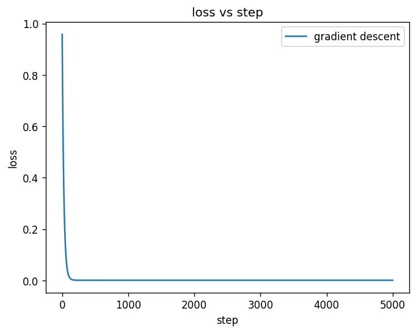

`fig-01` 检查优化过程，`fig-02` 把观测点、生成真值和 GD 拟合线放在一起。两条线接近说明当前一维线性结构足以描述这批数据。

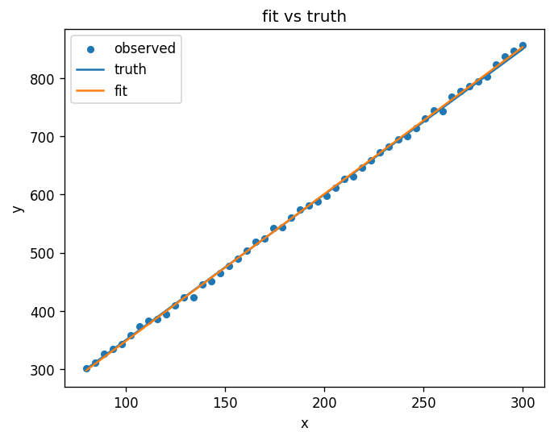

失败判据不只看 `0.00067`。如果残差随 `x` 呈现弯曲、扇形或分段模式，即使 GD 已经收敛，我也会判断模型漏掉了结构。这个失败会把问题带向能表达非线性关系的模型，Ch 5 会用神经网络继续处理；而在当前线性设定中，我先检查训练与测试是否表现一致，这就产生了下一节的 Issue。

### §4．2 Ridge：Issue 是收敛后仍有 train/test 差距

#### Issue

上一节证明线性模型可以收敛，但收敛只针对训练目标。把同一类 noisy data 按 `x` 顺序切成前 `40` 个训练样本和后 `10` 个测试样本后，训练区间与测试区间并不重合，模型需要向更高的 `x` 外推。此时要问的不是“loss 有没有下降”，而是“权重是否过度跟随训练噪声，以及测试区间是否还能保持合理误差”。

#### Method

我在 MSE 上加权重的 L2 惩罚，并保持截距不受惩罚。实现提供 `ridge_closed_form(X, y, alpha)` 和 `ridge_gd(X, y, alpha=0.1, lr=1e-2, n_steps=5000, seed=0)`。`alpha=0.1` 控制惩罚强度，GD 仍在缩放后的坐标中计算，再还原到原始单位。

L2 惩罚可以从约束的对偶直觉理解：限制权值 L2 范数的约束问题，可以写成在数据损失后加入一个带系数的 L2 项。于是我不需要在每一步把 `w` 硬裁回某个球内，而是让损失在拟合数据与较小权重之间同时产生梯度。其他正则方式也存在，本章先用 L2，因为它在这个一维例子里有闭式解，能继续与 GD 交叉验证。

#### Evaluation

`run_ridge_demo()` 返回 `alpha=0.1`、`closed_form_w=2.5088`、`gd_w=2.5087`、`train_loss=15.28`、`test_loss=37.40`。两个求解器的权重只差约 `0.0001`，说明实现路径相互吻合。训练损失低于测试损失并不奇怪，但这里的差距要诚实解释：测试点位于更高的 `x` 区域，Ridge 的预测在 test 上包含 extrapolation 误差，不能把 `37.40` 简写成“泛化变差”后就停止分析。

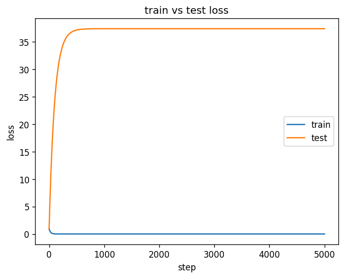

`fig-03` 把 train/test loss 放在同一坐标中，`fig-04` 直接比较 OLS 与 Ridge 的权重大小。图的目的不是宣称某根柱子越短越好，而是确认 L2 项确实改变了系数。

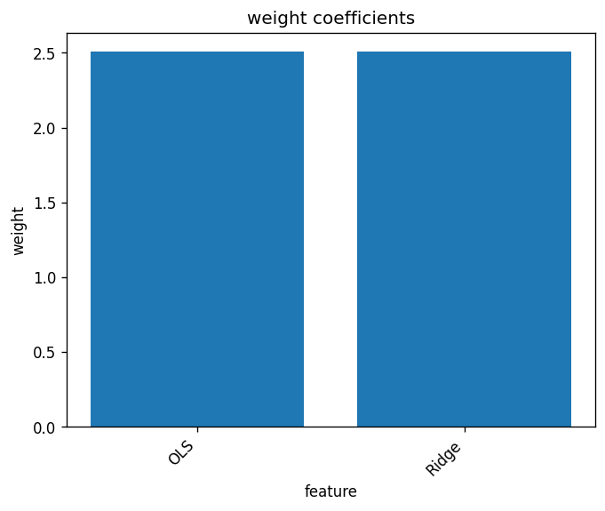

本节的失败判据是：若测试损失继续随训练下降而扩大，或权重缩小后预测偏差明显增大，我会重新检查数据切分、`alpha` 与模型结构，而不会只增加训练步数。Ridge 还暴露了一个新问题：L2 能把不重要的权重拉近零，却通常不会让它们精确等于零。如果项目需要自动变量筛选，接下来要换一个目标结构。

### §4．3 Lasso：Issue 是 Ridge 没有产生稀疏权重

#### Issue

上一节的 Evaluation 表明，较小权重不等于稀疏权重。现在我把任务改成六特征回归，其中真实关系只有三个特征起作用。如果拟合结束后六个权重都只是“小”，代码仍然不能直接告诉我应该保留哪三个变量。这个 Issue 的验收量也随之改变，除了预测损失，还要数精确非零权重。

#### Method

我把惩罚改成权重绝对值之和，并用 proximal gradient descent。每一步先按 MSE 梯度得到 `raw` 权重，再做 soft-thresholding：绝对值减去 `lr * alpha`，低于阈值的分量直接变成零，保留分量按原符号缩小。对应 API 是 `lasso_gd(X, y, alpha=0.1, lr=1e-2, n_steps=5000, seed=0)`。

L1 项在零点不可导，所以我没有假装普通 GD 能在零点给出唯一梯度。proximal 步把平滑的 MSE 更新与 L1 的阈值操作分开，正好保留“把一部分系数压成精确零”的行为。其他稀疏建模方法也存在，本章用 soft-thresholding，因为零值产生机制能直接从一行更新看出来。

#### Evaluation

`run_lasso_demo()` 返回 `alpha=0.1`、`gd_w=[1.89, 0, -1.07, 0, 0.22, 0]`、`num_nonzero=3`。真实生成权重是三个非零分量，拟合也留下三个非零分量，位置一致。数值没有逐项等于生成值，这是噪声、惩罚和有限样本共同作用的结果；本节要验证的是稀疏结构与变量筛选，而不是把带噪数据反解成原数组。

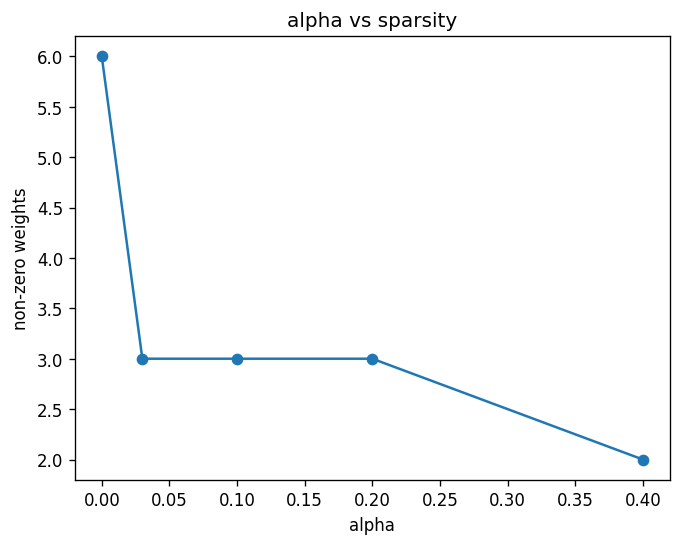

`fig-05` 展示不同 `alpha` 对 `num_nonzero` 的影响，`fig-06` 展示六个拟合系数，其中第二、第四、第六个权重为零。稀疏性的项目价值很直接：结果本身给出一份变量筛选，后续模型可以只保留非零特征再做验证。

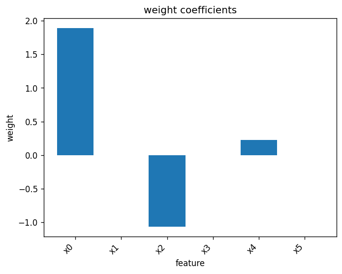

失败判据是：若真实相关特征被压成零，或无关特征仍大量非零，我会重新检查特征尺度、`alpha` 和验证集表现。到这里三个项目都在预测连续数值，新的 Issue 不再是正则方式，而是输出语义变成“是或否”时，直线回归的连续输出该如何解释。

### §4．4 逻辑回归：Issue 是任务变成二分类

#### Issue

前三节输出连续 `ŷ`。现在数据由两个二维高斯簇组成，标签只取 `0` 或 `1`，项目要回答每个点属于哪一类。连续直线仍可产生一个 score，但 score 本身不是概率，也没有给出适合 Bernoulli 标签的训练目标。因此我要同时改变输出解释和损失。

#### Method

我用 sigmoid 把 `X @ w + b` 映射到 `0` 与 `1` 之间，再用 BCE 训练 `w` 和 `b`。`predict_proba(X, w, b)` 返回概率，`predict_label(..., threshold=0.5)` 把概率转成整数标签，`logistic_regression_gd(..., lr=0.1, n_steps=2000, seed=0)` 用 full-batch GD 更新参数。

这一步使用 `torch.float64`。BCE 通过 `binary_cross_entropy_with_logits` 从 logits 计算，避免先取极端 sigmoid 概率再做 log 带来的数值问题。BCE 也正是 Bernoulli 标签的负 log-likelihood，所以模型的概率解释与训练目标一致。其他二分类损失也存在，本节用 BCE，因为这里需要概率输出，且概率假设清楚。

#### Evaluation

`run_logistic_regression_demo()` 返回 `accuracy=1.0`、`gd_w=[3.89, 3.53]`、`gd_b=0.17`，BCE 从 `0.5950` 下降到 `0.0028`。loss 与 accuracy 同时检查：前者说明概率分配越来越符合标签，后者说明以 `0.5` 为阈值时，固定数据上的 `100` 个样本全部分类正确。

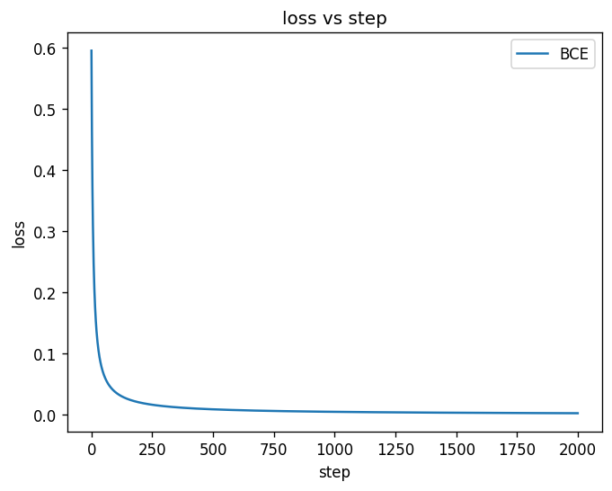

`fig-08` 把两个二维簇和分类区域画在一起。边界位于两簇之间，与 `w=[3.89, 3.53]`、`b=0.17` 定义的线性 score 相符。

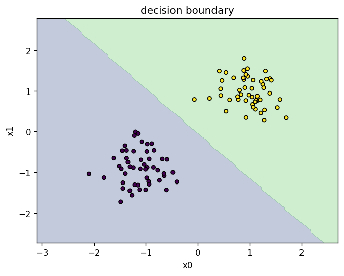

失败判据是：若 BCE 下降但 accuracy 不升，我会检查阈值和标签；若 accuracy 很高但边界穿过高密度区域，我会检查数据泄漏或分布切分；若 float32 下严格数值测试不稳定，则不能把波动解释成算法行为。当前二分类通过后，Evaluation 立刻暴露下一项限制：输出层只能表达两个类别。

### §4．5 Softmax 回归：Issue 是逻辑回归只能分两类

#### Issue

上一节只有“负类或正类”。现在数据有三个分离的二维高斯簇，标签取三个类别索引。为每个类别各写一个互不关联的二分类器，会让三个概率不一定合计为 `1`。项目需要一个共同归一化的类别分布，以及一个能直接训练真实类别 probability 的目标。

#### Method

我把权重参数化为 `W(2x3)`，偏置参数化为 `b(3)`。每个样本经 `X @ W + b` 得到三个 logits，再调用 `log_softmax(logits, dim=1)`，取真实类别的 log probability，求负均值得到 NLL。训练 API 是 `softmax_regression_gd(X, y, n_classes=3, lr=5e-1, n_steps=2000, seed=0)`，预测用 `predict_class` 的 `argmax`。

直接计算 `log(softmax(logits))` 在 logits 很大或很小时容易丢精度，`log_softmax` 把两步合在稳定实现里。其他多分类构造也存在，本节用共同 softmax 分布，因为每行概率和为 `1`，NLL 又能直接对应真实类别。

#### Evaluation

`run_softmax_regression_demo()` 返回 `accuracy=1.0`、`W` 形状为 `2x3`、`b` 形状为 `3`，loss 从 `1.13` 降到 `4.0e-4`。这里图名沿用项目文件名，但曲线实际记录的是多分类 NLL，不是二分类 BCE。三个类别各 `30` 个样本，混淆矩阵的非对角项为零，与 `accuracy=1.0` 一致。

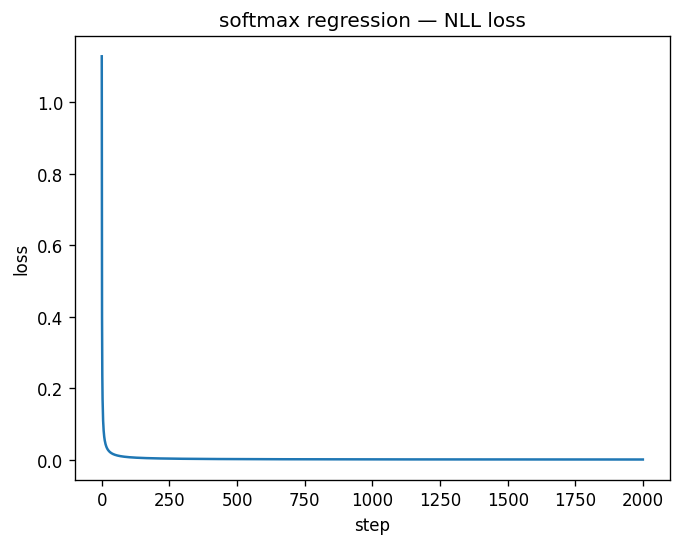

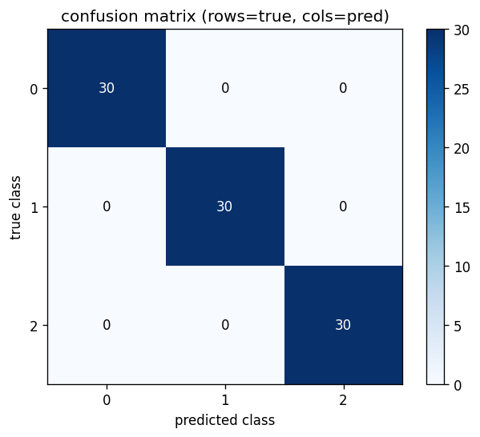

失败判据是：若概率行和偏离 `1`，先检查 softmax 维度；若 loss 下降但混淆矩阵某两个类别持续互相误判，我会检查特征是否线性可分，以及标签索引是否对齐。CNN 的最后一层会再次出现同样的 `W`、`b`、logits 与 Softmax，只是输入特征不再是两个手工坐标，而是卷积网络提取的表示。概率型分类到这里已经跑通，下一节故意换一个问题表述：我不再要求概率，而要直接约束分类间隔。

### §4．6 SVM：Issue 是改用间隔型 loss

#### Issue

逻辑回归与 Softmax 回归都从 likelihood 出发。现在我要问另一件事：如果项目只需要分隔两类，并希望边界由靠近间隔的样本决定，能否不用概率型 loss，直接把“分类正确且离边界有距离”写进目标？这就是 SVM 项目要验证的 Issue。

#### Method

我做了 hinge loss 加 L2。对每个标签为 `-1` 或 `+1` 的样本，`y * (X @ w + b)` 是带符号间隔；低于 `1` 的样本产生 `1 - margin` 损失，达到 `1` 后 hinge 项为零。目标再加 `0.5 *` 权重平方和，用 subgradient GD 更新 `w`、`b`。API 是 `svm_subgradient_gd(X, y, C=1.0, lr=1e-2, n_steps=3000, seed=0)`。

SVM 不直接最大化一个裸间隔，因为缩放 `w`、`b` 会同时缩放 score，必须固定函数间隔的尺度，并用权重范数把几何间隔写进可优化目标。hinge 只让间隔内样本产生分类项梯度，L2 则控制边界尺度。其他间隔损失也存在，本节用 hinge，因为 support vector 与 active hinge 样本能直接对应。

Ch 3 见过的 Lagrangian 与对偶在这里有了具体落点。SVM 的理论动机常从带间隔约束的 primal 问题出发，再借 Lagrangian 得到 dual 视角；本节只实现 primal 的 hinge 加 L2，不在这里展开对偶求解。

#### Evaluation

`run_svm_demo()` 返回 `accuracy=1.0`、`w` 形状为 `2`、`b=-0.0034`、`num_support_vectors=14`，loss 从 `1.0` 下降到 `0.18`。最终 loss 没有趋近零，因为目标中仍有权重 L2 项，而且靠近间隔的样本继续贡献 hinge 项；把非零 loss 当成失败会误读这个目标。

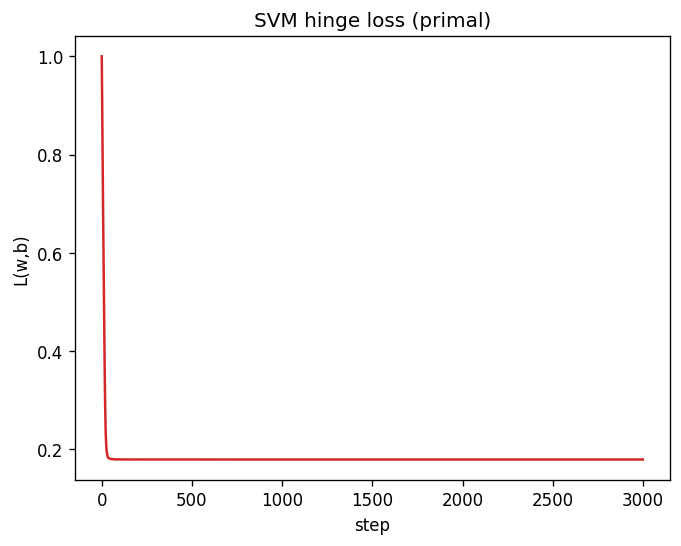

`fig-12` 画出决策区域，并用橙色空心圈标出靠近间隔的样本。`14` 个 support vectors 说明边界主要由这组样本钉住，而不是由远离边界的点平均决定。

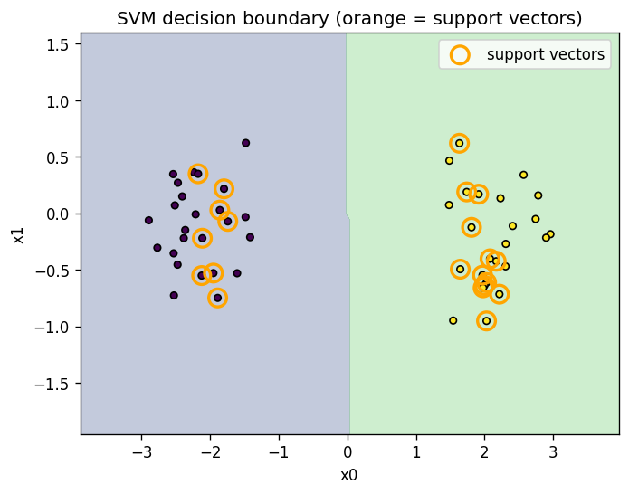

失败判据是：若 accuracy 上升但间隔内样本数量异常增多，我会检查 `C` 与数据尺度；若 loss 下降而 score 符号和标签相反，我会检查 `-1/+1` 编码与 subgradient 符号。到这里六个项目都是机器学习，Evaluation 留下一个更根本的问题：参数化、目标函数和验证这套设计，离开 ML 还能不能工作？

### §4．7 一维纵向速度规划：Issue 是非 ML 是否也能用同一套路

#### Issue

现在不再拟合标签。车辆从位置 `0`、速度 `0` 出发，在 `10` 秒 horizon 内到达 `s_target=10`、`v_target=2`。时间离散为 `T=20` 段，`dt=0.5` 秒。我要检查的是，同一个物理目标采用三种合理参数化后，是否会得到接近的终端状态，而不是只证明某一种写法能优化。

#### Method

第一种是状态点参数化。我直接优化 `s[1..T]` 与 `v[1..T]`，在终点误差之外加入 kinematic penalty，让相邻状态近似满足离散运动学，再加速度变化平滑项。API 是 `plan_via_state_points(s_target=10.0, v_target=2.0, T=20, dt=0.5, n_steps=500)`。

第二种是控制点参数化。我优化 `a[0..T-1]`，每轮都用 `_forward_integrate` 前向积分得到完整 `s` 与 `v`。运动学不再是 soft penalty，而是积分过程内的固定关系，目标只需加入终点误差、可选 waypoint 和较小的加速度惩罚。

第三种是多项式参数化。我优化一组三次 Bernstein 系数，在 `20` 个时刻采样出 `a(t)`，再走同一前向积分。系数比逐时刻控制点少，产生的加速度曲线也受多项式形状约束。其他轨迹参数化也存在，本节同时保留这三种，因为我要检验“变量不同，任务答案是否一致”，不是选出其中一个名字。

三种实现都用 `torch.float64` 和 Adam，默认 `lr=0.05`、`n_steps=500`。共同 Evaluation 看终点和曲线，不能直接比较三种 loss 的绝对大小来排顺序，因为状态点版本含 kinematic 与平滑 penalty，而另外两种通过积分固定运动学，目标组成并不完全相同。

#### Evaluation

`run_longitudinal_planning_demo()` 的实际返回如下。状态点参数化得到 `final_loss=0.0134`、`terminal_s=9.943`、`terminal_v=1.996`；控制点参数化得到 `final_loss=0.0008`、`terminal_s=10.000`、`terminal_v=2.000`；多项式参数化得到 `final_loss=0.0002`、`terminal_s=10.000`、`terminal_v=2.000`。

三个 `terminal_s` 的 spread 是 `0.057`，只占 `s_target=10` 的 `0.57%`，也小于 `1.0` 这一验收线。三个 `terminal_v` 的 spread 是 `0.004`，只占 `v_target=2` 的 `0.2%`，也小于 `0.6`。这两个 spread 是关键证据：决策变量不同，优化路径不同，但三种方法对同一终端任务给出了相近答案。

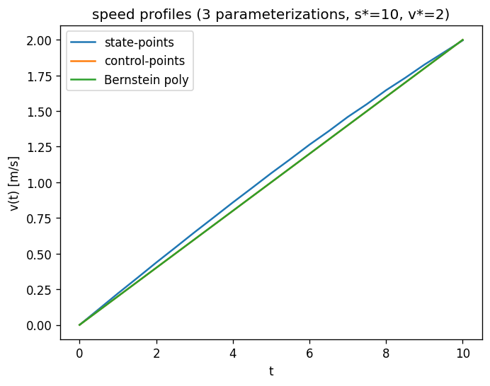

`fig-13` 检查三条 `v(t)` 是否都从初始状态走向相同终点，`fig-14` 则展示状态点、控制点和 Bernstein 多项式产生的 `a(t)`。终点一致不要求中间控制完全一样，参数化正是在中间轨迹形状上施加了不同结构。

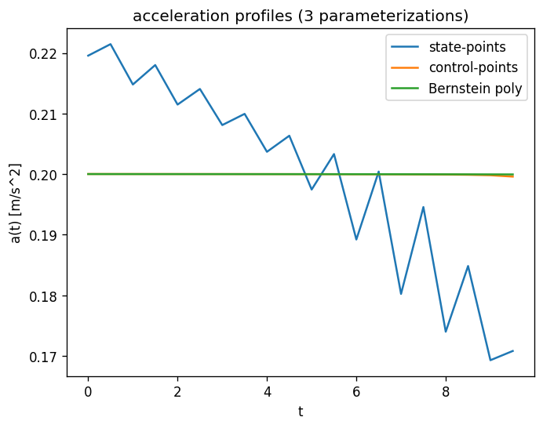

失败判据是任一 spread 越过门槛，`terminal_s spread ≥ 1.0` 或 `terminal_v spread ≥ 0.6`。出现这种情况时，我会检查学习率、平滑项、积分公式和优化步数，而不会凭一条看起来平滑的曲线宣布成功。这一节也给“设计两问”的通用性提供了硬证据：不管有没有训练数据，先定决策变量，再定目标函数，最后用跨参数化数字和图形验收，项目闭环没有改变。

## §5 验证

下面的命令都从 Ch 4 目录运行。先同步环境，再跑测试：

```bash
cd <项目根目录>/articles/04-optimization-applications
uv sync
PYTHONPATH=. .venv/bin/pytest tests/ -q
```

七个 demo 的入口都返回结构化结果。下面的命令既打印真实数字，也把图写入 `output/`：

```bash
PYTHONPATH=. .venv/bin/python -c "from pathlib import Path; from code.ex1_linear_regression import run_linear_regression_demo as run; print(run(save_dir=Path('output')))"
PYTHONPATH=. .venv/bin/python -c "from pathlib import Path; from code.ex2_ridge import run_ridge_demo as run; print(run(save_dir=Path('output')))"
PYTHONPATH=. .venv/bin/python -c "from pathlib import Path; from code.ex3_lasso import run_lasso_demo as run; print(run(save_dir=Path('output')))"
PYTHONPATH=. .venv/bin/python -c "from pathlib import Path; from code.ex4_logistic_regression import run_logistic_regression_demo as run; print(run(save_dir=Path('output')))"
PYTHONPATH=. .venv/bin/python -c "from pathlib import Path; from code.ex5_softmax_regression import run_softmax_regression_demo as run; print(run(save_dir=Path('output')))"
PYTHONPATH=. .venv/bin/python -c "from pathlib import Path; from code.ex6_svm import run_svm_demo as run; print(run(save_dir=Path('output')))"
PYTHONPATH=. .venv/bin/python -c "from pathlib import Path; from code.ex7_longitudinal_planning import run_longitudinal_planning_demo as run; print(run(save_dir=Path('output')))"
```

运行后检查 `14` 个 PNG：

```bash
python -c "from pathlib import Path; files=sorted(Path('output').glob('fig-*.png')); print(len(files)); print(*(p.as_posix() for p in files), sep='\n')"
```

预期计数是 `14`。数值检查可以压缩成一组锚点：OLS 的 `closed_form_w` 与 `gd_w` 都是 `2.5264`，Ridge 的 train/test loss 是 `15.28/37.40`，Lasso 的非零权重数是 `3`，三个分类 demo 的 accuracy 都是 `1.0`，SVM 有 `14` 个 support vectors，速度规划的 `terminal_s spread=0.057`、`terminal_v spread=0.004`。任一数字越出对应小节的失败判据，都应先视为实现、环境或目标设计发生了变化。

## §6 回顾

这一章把两个可迁移问题放进了七个项目：我让什么变量表示答案，我用什么目标函数表示好坏。OLS 用 `w`、`b` 与 MSE，Ridge 和 Lasso在同一回归骨架上改变正则项，逻辑回归与 Softmax 回归把 loss 接到概率假设，SVM 改用 hinge 与间隔，速度规划则把状态、控制和多项式系数作为三种决策变量。每个项目都用实际数字、图形与失败判据收口，前一个 Evaluation 还负责暴露下一个 Issue。

我们见过的深度仍然有限。这里没有进入深度学习模型，没有实现 kernel SVM，也没有展开 conjugate gradient、内点法、拟牛顿法或大规模约束求解。七个 demo 使用固定 seed 的小数据，分类 accuracy 为 `1.0` 只说明这些可分数据上的实现符合预期，不代表真实数据没有噪声、偏移或标签问题。

与 Ch 3 相比，Ch 3 让我们认得梯度、KKT、SGD 和 Adam；Ch 4 把这些工具放进了“定义问题、实现方法、验证结果”的闭环。现在再见到一个算法名，我们可以先找它的参数化、loss、评价数字和失败条件，而不是从背 API 开始。

## §7 下篇预告

Ch 5 会进入 CNN。图像张量会替代这里的二维点，卷积层会替代手工线性特征，但项目仍会先回答决策变量与目标函数，再用训练曲线和任务指标验证。它不是另一套范式，而是这一章设计思路在真实图像任务上的一次实例化。
